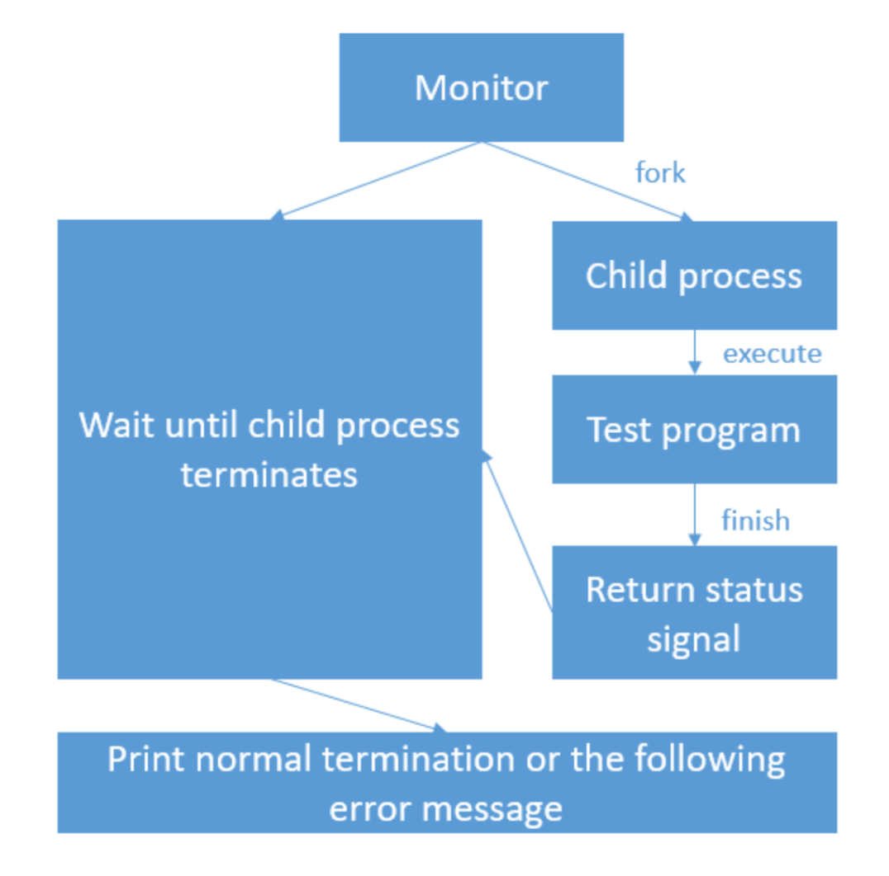
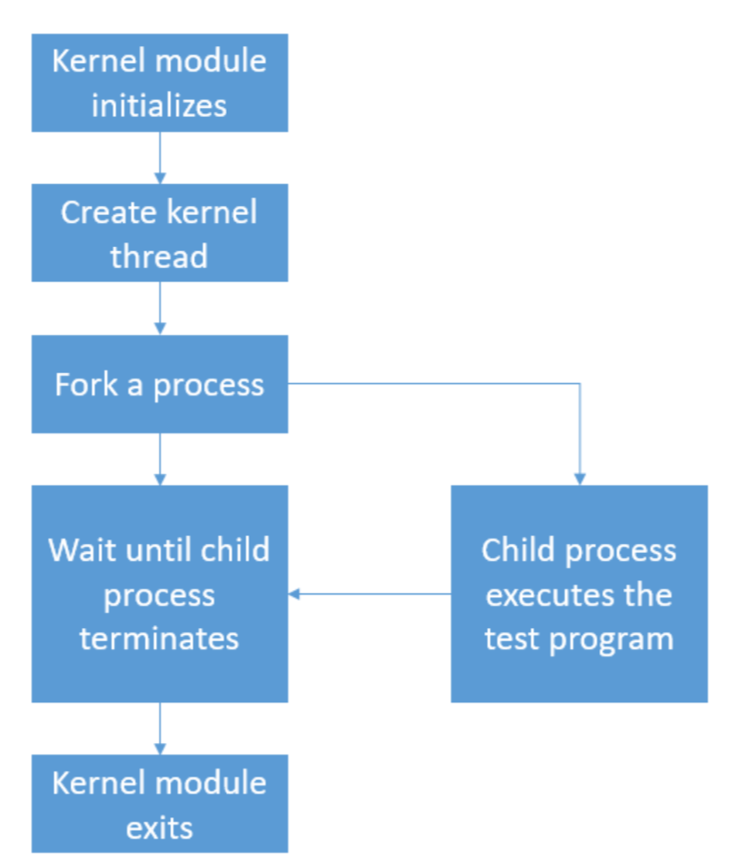

# <center>CSC3150 A1 Report

## Part1: Problem Brief
The project is divided into three parts. In part1, we are required to write a program(program1.c) to complete the tasks in part1. 

The tasks in part1 includes: 
1. Fork a child process to execute test programs (15 of them)
2. Use wait() to let the parent process receives the SIGCHLD signal 
3. Print out the termination information of child process (normal or abnormal)

The tasks in part2 includes:
1. Create a kernel thread and run my_fork function
2. Fork a process to execute test.o
3. Use do_wait() to let the parent process wait for the child process
4. Print out pid of both parent and child processes
5. Catch the signal raised by the child process and print out related log
6. Recompile the Linux kernel source code to use its functions

The tasks in bonus includes:
1. Execute the programs in arguments, as well as handle multiple input files
2. Extend new process with the former argument as parent to run each input files
3. Print out process tree and other relevant infomation

## Part2: Overall Project Structure



## Part3: Program Design
#### Program1:

>Fork the child process
>```C
>pid_t pid;
>printf("Process start to fork\n");
>pid = fork();
>```
> 
>wait for SIGCHLD signal
>```C
>/* wait for child process terminates */
>waitpid(-1, &status, WUNTRACED);           
>printf("Parent process receives the SIGCHLD signal\n");
>```
> 
> 
>Child process execute test programs
>```C
>if (pid == 0) { // child process
>    int i;
>    char *arg[argc];
>
>    for (i = 0; i < argc - 1; i++) {
>        arg[i] = argv[i + 1];
>    }
>    arg[argc - 1] = NULL;
>
>    /* execute test program */
>    printf("I'm the child process, my pid = %d\n", getpid());
>    printf("Child process start to execute test program:\n");
>    // start execute the program
>    execve(arg[0], arg, NULL);
>
>    printf("Continue to run original child process!\n");
>
>    perror("execve");
>    exit(SIGCHLD);
>```
>
>Analyse exit status and print out info
>```C
>/* check child process'  termination status */
>if(WIFEXITED(status)){ // normal exit
>    printf("Normal termination with EXIT STATUS = %d\n",WEXITSTATUS(status));
>}
>
>else if(WIFSIGNALED(status)){ // abnormal exit
>    int num = WTERMSIG(status);
>    switch (num){
>        case 6: // SIGABRT
>            printf("child process get SIGABRT signal\n");
>            printf("child process is abort by abort signal\n");
>            printf("CHILD EXECUTION FAILED!!\n");
>            break;
>        case 14: // SIGALRM
>            printf("child process get SIGALRM signal\n");
>            printf("child process is abort by alarm signal\n");
>            printf("CHILD EXECUTION FAILED!!\n");
>            break;
>        case 7: // SIGBUS
>            printf("child process get SIGBUS signal\n");
>            printf("child process is abort by bus error signal\n");
>            printf("CHILD EXECUTION FAILED!!\n");
>            break;
>        ......
>    }
>
>}
>else if(WIFSTOPPED(status)){ // stop signal
>    printf("child process get SIGSTOP signal\n");
>    printf("child process stopped\n");
>    printf("CHILD EXECUTION STOPPED\n");            }
>else{
>    printf("CHILD PROCESS CONTINUED\n");
>}
>```

#### Program2
>Create a kernel thread and run my_fork
>```C
>task = kthread_create(&my_fork, NULL, "MyThread");
>//wake up new thread if ok
>if (!IS_ERR(task)) {
>    printk("[program2] : Module_init kthread starts\n");
>    wake_up_process(task);
>}
>```
>
>Fork a process and print out pid
>```C
>pid_t pid;
>/* fork a process using do_fork */
>pid = _do_fork(SIGCHLD, (unsigned long) &my_exec, 0, NULL, NULL, 0);
>
>printk("[program2] : The child process has pid= %d\n", pid);
>printk("[program2] : The parent process has pid= %d\n", (int) current->pid);
>```
>
>Execute the test program
>```C
>int my_exec(void) {
>   int result;
>   const char path[] = "/mnt/hgfs/CSC3150/Project/CSC3150_Assignment_1/
>        source/program2/test";
>   const char *const argv[] = {path, NULL, NULL};
>   const char *const envp[] = {"HOME=/", "PATH=/sbin:/user/sbin:/bin:/usr/bin", NULL};
>
>   struct filename *my_filename = getname(path);
>
>   /* execute a test program in child process */
>   printk("[program2] : child process");
>
>   result = do_execve(my_filename, argv, envp);
>   
>   if (!result) {
>       return 0;
>   } else {
>       do_exit(result);
>   }
>}
>```
>
>Wait for child process termination
>```C
>void my_wait(pid_t pid) {
>    struct wait_opts wo;
>    struct pid *wo_pid = NULL;
>    enum pid_type type;
>    type = PIDTYPE_PID;
>    wo_pid = find_get_pid(pid);
>
>    wo.wo_type = type;
>    wo.wo_pid = wo_pid;
>    wo.wo_flags = WEXITED;
>    wo.wo_info = NULL;
>    wo.wo_stat = (int __user*)&status;
>    wo.wo_rusage = NULL;
>
>    int a;
>    a = do_wait(&wo);
>
>    output_info(status);
>
>    put_pid(wo_pid);
>   return;
>}
>```
>
>Catch the signal and printed out message
>```C
>void output_info(int exit){
>    switch (exit) {
>        case 1:
>            printk("[program2] : get SIGHUP signal\n");
>            printk("[program2] : child process is hung up\n");
>            printk("[program2] : The return signal is 1\n");
>            break;
>        case 2:
>            printk("[program2] : get SIGINT signal\n");
>            printk("[program2] : terminal interrupt\n");
>            printk("[program2] : The return signal is 2\n");
>            break;
>        case 131:
>            printk("[program2] : get SIGQUIT signal\n");
>            printk("[program2] : terminal quit\n");
>            printk("[program2] : The return signal is 3\n");
>            break;
>        ......
>    }
>    return;
>}
>```
>
>Recompile the kernel in order to use kernel function
>
>Since I am able to declare these extern functions and use them in my program, 
>it proves that I have recompiled the kernel and exported these symbols. 
>```C
>extern long do_wait(struct wait_opts *wo);
>extern struct filename * getname(const char __user * filename);
>extern long _do_fork(unsigned long clone_flags,unsigned long stack_start,
>       unsigned long stack_size,int __user *parent_tidptr, int __user *child_tidptr,
>       unsigned long tls);
>extern int do_execve(struct filename *filename,const char __user *const __user *__argv, 
>       const char __user *const __user *__envp);
>```

#### Bonus
```C
struct Node {
    int index;
    char filename[200];
    pid_t my_pid;
    pid_t child_pid;
    struct Node *nxt_node;
};
```
A node which includes info about the binary file to be run

```C
struct StatusNode {
    int code;
    struct StatusNode *nxt_StatusNode;
};
```
A linked list storing status info about each binary file

```C
void execute_file(struct Node *node);
```
Execute binary file with a Node as a parameter

```C
void fork_node(struct Node *parent_node);
```
Fork a new process using Node as its parameter

```C
void fork_same(struct Node *last_node);
```
Used for fork the process for the last binary file 
(no new file needs to be handled so it is a seperate function)

```C
void status_info(int status);
``` 
Print out infomation about status of a binary file according to its exit code

```C
void process_tree(struct Node *first_node);
```
Print out the process tree

```C
void add_status(int status);
void add_laststatus(int status);
```
Add status info to the status linked list

```C
void print_status();
```
Print out all process status info of all binary files

```C
int convert2signal(int exit_code);
```
Convert a exit code to the corresponding signal

## Part4: Program Environment
Virtual machine application: VM Ware fusion 11

The program is run on a Ubuntu 16.04 LTS operation system, with kernel version 4.10.14.

Compiler: gcc version 5.4.0

(Please change the program path in my codes before run them)
If there is any problem, it might be the problem with different environment.
Same happens to me when I run my code on my MacBook fine, but can only run after some
modification on my Ubuntu virtual machine. If my code cannot run, please contact me
and I can run my code on my laptop. 

## Part5: How to run my program
#### Program1:
```bash
cd ./program1
make
./program1 filename
```

#### Program2:
```bash
cd ./program2
gcc test.c -o test
make
insmod program2.ko
rmmod program2.ko
dmesg | tail -n 10
```
#### Bonus:
```bash
cd ./bonus
make
./my_fork hangup normal8 trap
```
(You might need to export functions in linux kernel and recompile first)